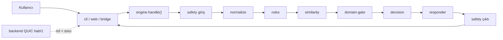

# PROJECT_STATE

> Bu dosya "Çelebi" kural-tabanlı chatbot repo'sunundur. Kardeş repolar:
> `hezarfen_backend`, `hezarfen_frontend`, `hezarfen_rag` (her birinin kendi
> PROJECT_STATE.md'si var). Bu repo, büyük projenin **aktif geliştirme** ucudur.

## 1. Anlık Durum
- Son güncelleme: 2026-08-16 (saat: DOĞRULANMADI)
- Aktif branch: `chore/podman-deploy`
- Son commit: `37653c6 chore(deploy): .dockerignore ekle`
- Çalışma ağacı: **temiz** (`git status --porcelain` boş)
- Tek cümle: Role-space V2 canlı (57 intent), **351 test yeşil**; 5-boyutlu "açık" denetimi bitti ve bulgular çıkarıldı, ancak düzeltmeler **henüz uygulanmadı**; T1 kapsamı (68 intent) `feat/t1-coverage`'ta **MERGE EDİLMEMİŞ**.

## 2. Hedef ve Kapsam
- **Ana hedef:** Hezarfen okul-yönetim sitesi için rol-farkında, sızıntısız, offline kullanım asistanı + içerik güvenlik katmanı; backend'e QUIC köprüsüyle bağlı.
- **Tamamlanma tanımı:** kullanıcı menüdeki her öğeyi (üst + alt başlık) **rolüne uygun ve sızıntısız** açıklayabiliyor; denetimdeki Critical/High açıklar kapalı; tüm testler yeşil; backend paritesi doğru.
- **Kapsam dışı:** gerçek veri çekip gösterme — bot yalnızca "nasıl yaparım" açıklar, öğrenci/karne verisi DÖNDÜRMEZ; generic ödev/ders-programı/duyuru intent'leri (kaldırıldı, geri eklenmeyecek).
- **Değiştirilemez kısıt:** sıfır harici bağımlılık (stdlib; yalnız köprü için aioquic); no-leak DENY (adım/rota/üst-rol adı sızmaz); her değişiklik ayrı branch + PR (geri alınabilir).

## 3. Çalıştırma ve Doğrulama
- **Kurulum:** harici bağımlılık yok (Python 3.13). Köprü için `aioquic`.
- **Çalıştırma:** `python -m src.main --chat` (terminal) · `python -m src.web` (dev web http://127.0.0.1:8000) · köprü: `python -m src.bridge` (QUIC "hab/1", backend'e dial-in, `chat.reply` register).
- **Katalog doğrulama:** `python -m src.main --validate` → DOĞRULANDI 2026-08-16: OK, Intent 57 / Cevap 57 / Kategori 15 / Örnek 331.
- **Unit + integration + e2e (tümü):** `python -m unittest discover -s tests -t .` → **DOĞRULANDI 2026-08-16: Ran 351 tests, OK (skipped=1), 61.9s.**
- **Metrik raporu:** `python -m src.main --evaluate`.
- **Lint/typecheck/build:** yok (stdlib script).
- **Ortam (gizli değil):** `AI_SHARED_TOKEN` (yerelde `change-me`); backend QUIC `:8090`; sertifika `GET /ai/certificate`.

## 4. Mimari Özet
- **Boru hattı:** `safety(giriş) → normalize → rules → similarity(TF-IDF char n-gram) → domain-gate → decision → responder → safety(çıktı)`.
- **Başlangıç noktası:** `engine.Engine().handle(payload)` (backend sözleşmesi). Ön yüzler: `cli.py`, `web.py`, `bridge.py`.
- **Ana modüller:** `catalog`(INTENTS/INTENT_ROUTES/ROUTE_LABELS/min_role) · `rules`(folded-token prefix eşleşme) · `similarity` · `domain` · `decision`(eşik 0.18) · `responder` · `role_spaces`(rol-space derleyici: `_ACTION_RULES`, `_view`, `_deny_text`, `_OWN_REPORT_RESPONSES`) · `safety/`(toxicity, pii, authorization, rate_limiter, decisions) · `engine`(handle, `_build_navigation`, multi-request) · `observability` · `evaluation/`.
- **Roller:** `ziyaretci < veli < ogrenci < ogretmen < yonetici < admin`; binary ALLOW/DENY.
- **Dış bağımlılık:** backend'in QUIC AI köprüsü (hab/1); soranın ROLÜ payload'da gelir.

## 5. Teknik Kararlar
- **D1** — Role-space V2: runtime'da binary ALLOW/DENY; CLARIFY-for-scope kaldırıldı (bot açıklar, scope doğrulamaz). **kabul edildi**.
- **D2** — No-leak DENY: deny/override metni adım/rota/üst-rol adı içermez; `required_role` yalnız metadata. **kabul edildi**.
- **D3** — Kural katmanı stem kullanmaz (folded prefix ≥2 char); belirsizlikte None → benzerliğe bırakır. **kabul edildi**.
- **D4** — Her değişiklik ayrı branch + PR (geri alınabilir). **kabul edildi**.
- **D5** — T1 kapsamı (appointments/meals/qpool/boards) ayrı branch; canlı hatta indirilmesi **önerildi** (bekliyor).
- **D6** — Backend parite düzeltmesi: `pomodoro_use` ve `event_attendance_mark` chatbot'ta backend'den fazla izin veriyor (bkz. §9 BUG-04/05). **önerildi**.

## 6. Aktif Görev
- **ID:** TASK-CHAT-FIX
- **Amaç:** denetimde çıkan açıkları kapat + menü kapsamını tamamla.
- **Kapsam:** (a) T1 kapsamını canlı hatta getir → (b) dead-end/çakışma/sızıntı/parite/güvenlik düzeltmeleri → (c/d) eksik yaprak + bölüm-özeti intent'leri.
- **İlgili dosyalar:** `role_spaces.py`, `engine.py`, `responder.py`, `catalog.py`, `rules.py`, `safety/*`, `tests/e2e/*`, `data/benchmark.jsonl`.
- **Bağımlılıklar:** T1'in git'te nasıl indirileceği kararı (kullanıcıdan) — bkz. §10 açık soru.
- **Kabul kriterleri:** Critical/High bulgular kapalı; `unittest discover` ≥351 yeşil kalır; `behavior_matrix` + `benchmark.jsonl` güncellenir; no-leak testi multi-request'i de kapsar.
- **Doğrulama komutları:** `python -m src.main --validate`; `python -m unittest discover -s tests -t .`; `python -m src.main --evaluate`.
- **Gerçek test sonucu:** BAZ 351 test yeşil (2026-08-16). Düzeltme kodu **HENÜZ BAŞLAMADI**.
- **Kalan iş:** tümü (a→b→c/d).
- **Durum:** `ACTIVE` (kullanıcı a+b'yi onayladı; sırayı ben belirledim: a→b).
- **Sonraki kesin işlem:** T1 landing hedefini netleştir (`feat/t1-coverage` → `main` merge mi, yoksa ayrı `integration/*` branch mi), sonra o branch'te `unittest discover` çalıştırıp yeşil doğrula, ardından TASK-CHAT-B'ye geç.

## 7. Görev Kuyruğu
- **TASK-CHAT-A** — P1 — T1 kapsamını canlı hatta getir (Randevular/Yemekler/Soru havuzu/Beyaz tahtalar). dep: landing kararı. **TODO**. kabul: 68 intent canlı + testler yeşil.
- **TASK-CHAT-B** — P1 — Düzeltmeler: dead-end `_OWN_REPORT_RESPONSES` (#1-5), suggestion-chip→fallback (#10), multi-request rol sızıntısı, report_card/attendance nav butonu, pomodoro/event parite. dep: A. **TODO**.
- **TASK-CHAT-C** — P2 — Eksik yaprak intent'leri: Ücretler, Şubeler, Takvim, Bugün, Soru bankası. dep: A. **TODO**.
- **TASK-CHAT-D** — P2 — Bölüm-özeti intent'leri (9 üst başlık; help_capabilities çakışmasını çöz). dep: C. **TODO**.
- **TASK-CHAT-E** — P3 — Safety sertleştirme: homoglyph/mixed-script, dotted-phone PII, threat/self-harm kökleri, authz wiring. **TODO**.

## 8. Tamamlanan İşler (son 10)
- Role-space V2 (`feat/role-space-v2`, 53 intent, no-leak) — test yeşil — commit serisi role-space-v2.
- Podman-on-WSL2 deploy paketi (`chore/podman-deploy`: Containerfile + custom kernel + rootless) — `deploy/`.
- **5-boyutlu açık denetimi (bu oturum):** A dead-end **11**, B izolasyon **7**, C çakışma **~7** (engine probe ile doğrulandı), D parite **2** (backend kanıtlı), E safety **14**. Kanıt: sohbet + `~/.claude/.../memory`.
- **Chatbot test tabanı doğrulandı:** 351 test yeşil (2026-08-16).

## 9. Bilinen Hatalar ve Riskler
- **BUG-01** (Critical) — Multi-request'te bölüm başlığı üst-rol adını sızdırıyor ("(Öğretmen+)"). Tekrar: ogrenci → "sınav oluştur ve ders aç". Neden: `engine.py:~563` `info["description"]` kullanıyor. Bölge: engine multi-request. Durum: AÇIK.
- **BUG-02** (High) — report_card/attendance: non-student rollere öğrenci-özel `/marks`,`/attendance` nav butonu basılıyor. Neden: `reports.read_own` ALLOW + override outcome ALLOW kalıyor (`role_spaces.py:219`). Durum: AÇIK.
- **BUG-03** (High/UX) — `_OWN_REPORT_RESPONSES` "Hangi öğrenciyi belirt" der ama bot stateless → çıkmaz; ayrıca doğru rota (`/management/student-marks`) gizli. Durum: AÇIK.
- **BUG-04** (High parite) — `event_attendance_mark` öğrenciye "kendini işaretle" der, backend Teacher+ only (`hezarfen_backend/src/web/events.rs:481-500` "students never mark"). Durum: AÇIK.
- **BUG-05** (High parite) — `pomodoro_use` 5 role izin verir, backend Student-only (`hezarfen_backend/src/web/pomodoro.rs:30,117-131`). Durum: AÇIK.
- **BUG-06** (High çakışma) — "soru sormak istiyorum" → `exam_add_question` (öğrenci DENY); "dersim var mı" → `exam_rejoin_retake` (DENY); "ayarlar"/"dil-tema" → `school_settings` (DENY); "derse kaydolmak" → `register_how`. Neden: benzerlik/prefix çakışması. Durum: AÇIK.
- **BUG-07** (High safety) — homoglyph/mixed-script hakaret + noktalı telefon PII gate'i atlıyor. Bölge: `safety/toxicity.py`, `safety/pii.py`. Durum: AÇIK.
- **KAPSAM** — 5 yaprak (Ücretler/Şubeler/Takvim/Bugün/Soru bankası) + 9 bölüm başlığı için intent YOK → fallback. T1 4 yaprağı ekler ama merge edilmedi.
- Ayrıntılı kütük: bkz. memory `hezarfen-chatbot-nav-coverage-gaps` + bu oturumun denetim çıktıları.

## 10. Son Oturum Devri
- **Bu oturumda:** RAG-kaynağı sorusu araştırıldı; 5-boyutlu açık denetimi yürütüldü (3 ajan tamamlandı, 2'si kendi probe/grep'imle yapıldı); C çakışmaları `scratchpad/probe_c.py` ile deterministik doğrulandı; backend paritesi (pomodoro/event) kanıtlandı; PROJECT_STATE.md dosyaları oluşturuldu.
- **Değiştirilen dosyalar (bu repo):** yalnız `PROJECT_STATE.md` (yeni). Kaynak koda dokunulmadı.
- **Çalıştırılan komutlar:** `--validate` (OK), `unittest discover` (351 yeşil), engine probe (çakışmalar doğrulandı), git durum incelemeleri.
- **Tamamlanmamış:** TASK-CHAT-A/B/C/D/E — hiçbiri başlamadı.
- **Açık soru:** T1 nasıl indirilecek? `feat/t1-coverage` → `main` merge mi, yoksa `chore/podman-deploy` üstüne yeni bir `integration/*` branch mi? Kullanıcı "never straight to integration branch" diyor → merge/PR yolu tercih edilmeli.
- **Yeni sohbetin ilk kesin adımı:** bu dosyayı + `git status` + `git log -3`'ü oku; `python -m unittest discover -s tests -t .` ile 351 yeşil'i teyit et; sonra §10 açık sorusunu kullanıcıya sor ve TASK-CHAT-A'yı başlat.
