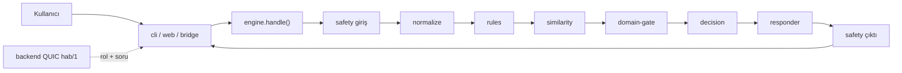

# PROJECT_STATE

> Bu dosya "Çelebi" kural-tabanlı chatbot repo'sunundur. Kardeş repolar:
> `hezarfen_backend`, `hezarfen_frontend`, `hezarfen_rag` (her birinin kendi
> PROJECT_STATE.md'si var). Bu repo, büyük projenin **aktif geliştirme** ucudur.

## 1. Anlık Durum
- Son güncelleme: 2026-08-22
- Aktif branch: `fix/chatbot-adversarial` (push edildi, PR bekliyor)
- Son commit: `4797959 feat: Faz 2 dialog-state -> conversation %100, adversarial %99.1`
- Çalışma ağacı: **temiz** (bu güncelleme hariç)
- Tek cümle: **adversarial %45.7 → %99.1** (228/230), **365 test yeşil (0 skip)**,
  macro-F1 0.994, coverage %99, OOS %92.3; 10 suite'ten **8'i %100** (conversation dahil),
  collision %97.4, negation %95, critical %100; hard gate'ler privacy=1.0 + kural=1.0 +
  **mutation %100** + **AURC 0.0000** + seçici risk **%0** + **OOS false-accept %0** (0/46).
  **CANLIYA-ÇIKIŞ KAPISI AÇIK** — kalan 2 adversarial vakası bilinçli asla-yanlış clarify
  (hata değil). **Üretim şartı:** bridge `session.user_id` göndermeli (çok-turlu diyalog).
  T1 kapsamı ayrı iş (deployed podman branch'te hâlâ 57 intent, #15).

## 2. Hedef ve Kapsam
- **Ana hedef:** Hezarfen okul-yönetim sitesi için rol-farkında, sızıntısız, offline kullanım asistanı + içerik güvenlik katmanı; backend'e QUIC köprüsüyle bağlı.
- **Tamamlanma tanımı:** kullanıcı menüdeki her öğeyi (üst + alt başlık) **rolüne uygun ve sızıntısız** açıklayabiliyor; denetimdeki Critical/High açıklar kapalı; tüm testler yeşil; backend paritesi doğru.
- **Kapsam dışı:** gerçek veri çekip gösterme — bot yalnızca "nasıl yaparım" açıklar, öğrenci/karne verisi DÖNDÜRMEZ; generic ödev/ders-programı/duyuru intent'leri (kaldırıldı, geri eklenmeyecek).
- **Değiştirilemez kısıt:** sıfır harici bağımlılık (stdlib; yalnız köprü için aioquic); no-leak DENY (adım/rota/üst-rol adı sızmaz); her değişiklik ayrı branch + PR (geri alınabilir).

## 3. Çalıştırma ve Doğrulama
- **Kurulum:** harici bağımlılık yok (Python 3.13). Köprü için `aioquic`.
- **Çalıştırma:** `python -m src.main --chat` (terminal) · `python -m src.web` (dev web http://127.0.0.1:8000) · köprü: `python -m src.bridge` (QUIC "hab/1", backend'e dial-in, `chat.reply` register).
- **Katalog doğrulama:** `python -m src.main --validate` → DOĞRULANDI 2026-08-16: OK, Intent 57 / Cevap 57 / Kategori 15 / Örnek 331.
- **Unit + integration + e2e (tümü):** `python -m unittest discover -s tests -t .` → **DOĞRULANDI 2026-08-16: Ran 351 tests, OK (skipped=1), 61.9s.**
- **Metrik raporu:** `python -m src.main --evaluate`.
- **Lint/typecheck/build:** yok (stdlib script).
- **Ortam (gizli değil):** `AI_SHARED_TOKEN` (yerelde `change-me`); backend QUIC `:8090`; sertifika `GET /ai/certificate`.

## 4. Mimari Özet
- **Boru hattı:** `safety(giriş) → normalize → rules → similarity(TF-IDF char n-gram) → domain-gate → decision → responder → safety(çıktı)`.
- **Başlangıç noktası:** `engine.Engine().handle(payload)` (backend sözleşmesi). Ön yüzler: `cli.py`, `web.py`, `bridge.py`.
- **Ana modüller:** `catalog`(INTENTS/INTENT_ROUTES/ROUTE_LABELS/min_role) · `rules`(folded-token prefix eşleşme) · `similarity` · `domain` · `decision`(eşik 0.18) · `responder` · `role_spaces`(rol-space derleyici: `_ACTION_RULES`, `_view`, `_deny_text`, `_OWN_REPORT_RESPONSES`) · `safety/`(toxicity, pii, authorization, rate_limiter, decisions) · `engine`(handle, `_build_navigation`, multi-request) · `observability` · `evaluation/`.
- **Roller:** `ziyaretci < veli < ogrenci < ogretmen < yonetici < admin`; binary ALLOW/DENY.
- **Dış bağımlılık:** backend'in QUIC AI köprüsü (hab/1); soranın ROLÜ payload'da gelir.

## 5. Teknik Kararlar
- **D1** — Role-space V2: runtime'da binary ALLOW/DENY; CLARIFY-for-scope kaldırıldı (bot açıklar, scope doğrulamaz). **kabul edildi**.
- **D2** — No-leak DENY: deny/override metni adım/rota/üst-rol adı içermez; `required_role` yalnız metadata. **kabul edildi**.
- **D3** — Kural katmanı stem kullanmaz (folded prefix ≥2 char); belirsizlikte None → benzerliğe bırakır. **kabul edildi**.
- **D4** — Her değişiklik ayrı branch + PR (geri alınabilir). **kabul edildi**.
- **D5** — T1 kapsamı (appointments/meals/qpool/boards) ayrı branch; canlı hatta indirilmesi **önerildi** (bekliyor).
- **D6** — Backend parite düzeltmesi: `pomodoro_use` ve `event_attendance_mark` chatbot'ta backend'den fazla izin veriyor (bkz. §9 BUG-04/05). **önerildi**.

## 6. Aktif Görev
- **ID:** TASK-CHAT-LIVE (canlıya-çıkış hazırlığı)
- **Amaç:** Kalite kapısı GEÇİLDİ; kalan yalnızca canlı-öncesi entegrasyon.
- **Durum:** `READY-FOR-REVIEW` — kullanıcı yeniden test edecek (kriterleri geçtik).
- **Kalan (kapıyı engellemez):**
  1. **Bridge `session.user_id`** — çok-turlu diyalog üretimde çalışsın + kullanıcı
     izolasyonu. `hezarfen_backend` AI köprüsü her istekte user_id taşımalı. (ZORUNLU)
  2. Buton/öneri wire (#21 backend+frontend) — "en son"; chip motor tarafı hazır.
  3. OOS shadow-set büyütme (≤%1 için ~300 near-OOS; rule-of-three) — üretim logları.
  4. (Ops.) gömme-tabanlı OOS detektörü — kelime-listesi guard yerine (literatür).
  5. T1 kapsamı landing (#15) — deployed branch'te hâlâ 57 intent.

**TAMAMLANDI (bu kampanya, %45.7→%99.1):** denetim düzeltmeleri, RULE_ONLY kapsam,
safety, negation, tail-batch, **Faz 1 conversation** (stateless), **OOS-sertleştirme**
(near-OOS false-accept %0), **Faz 2 dialog-state** (conversation %100), **ölçüm
altyapısı** (selective+mutation). Detay §8.

## 7. Görev Kuyruğu
- **TASK-CHAT-CONV** — P1 — conversation_humanlike (dialog-state). **BLOCKED** (kullanıcı onayı). Bkz §6.
- **TASK-CHAT-UI** — P1 — Buton/öneri wire: `chat.reply` köprüsü yalnız `text` taşıyor,
  `navigation`(buton)+`suggestions`(öneri) köprüde düşüyor. backend #29 + frontend #55 +
  chatbot #21. **TODO** (kullanıcı "en son yaparız" dedi; issue'lar açık, kullanıcı atayacak).
- **TASK-CHAT-CHIP** — P2 — Önerilen soruya tıklayınca fallback (#12/B07): çip ham intent
  id yayınlıyor. **TODO**.
- **TASK-CHAT-B/C/D/E — TAMAMLANDI** (adversarial turlarında): dead-end metinler, nav
  sızıntısı, parite, 10 kapsam intent'i, bölüm-özeti (nav_overview), safety sertleştirme
  hepsi uygulandı (#8-#13,#16-#19 kapalı).
- **TASK-CHAT-A (T1 landing)** — P1 — deployed podman branch'te hâlâ 57 intent; T1 (68)
  `feat/t1-coverage`'ta merge edilmemiş. #15 açık. Ayrı deployment kararı (§10).

## 8. Tamamlanan İşler (son 10)
- **Adversarial düzeltme kampanyası (`fix/chatbot-adversarial`, 7 tur, 2026-08-22):**
  %45.7 → **%93.0** (214/230). Turlar: parite/no-leak/şık-FP → safety_recall+collision →
  negation → coverage(10 intent+rule-only) → gate-blocker'lar → tail-batch. Commit'ler:
  `c32580b`,`beaa8ac`,`d75e3d8`,`ec4d3b0`,`6f2764b`,`1acd660`,`125ccd8`,`825a779`.
- **Kapatılan issue'lar:** #8 (collision), #9/#10/#11 (parite+sızıntı), #13 (zararlı-niyet),
  #16/#17 (kapsam intent'leri), #18 (safety), #19 (kök/prefix).
- **RULE_ONLY_INTENTS mimarisi:** 10 kapsam intent'i similarity/domain/role_spaces
  vocab'ına girmez → IDF/OOS kirlenmeden coverage_gap %5→%100.
- **Test tabanı:** 351 (1 skip) → **352 (0 skip), OK**; embedding skip kaldırıldı.
- Role-space V2 (`feat/role-space-v2`, 57 intent, no-leak) + Podman-on-WSL2 deploy paketi.

## 9. Bilinen Hatalar ve Riskler
- **BUG-01..07: FİXLENDİ** (`fix/chatbot-adversarial`). Multi-request nötr başlık;
  non-student nav suppress; dead-end metin yeniden yazıldı; event Teacher+ / pomodoro
  Student-only parite; collision none-guard'ları (soru/dersim/ayarlar/kaydol); homoglyph/
  fullwidth fold + separatör-toleranslı PII. Doğrulama: adversarial + 352 test yeşil.
- **KAPSAM: FİXLENDİ** — 10 kapsam intent'i (fees/branches/calendar/today/qbank/nav_overview
  vb.) + "henüz canlı değil" → coverage_gap %100.
- **AÇIK — B07/#12** (Orta) — önerilen soruya tıklayınca fallback (çip ham intent id). TASK-CHAT-CHIP.
- **AÇIK — B14/#21** (Yüksek UX) — `chat.reply` köprüsü text-only; buton+öneri düşüyor.
  backend+frontend wire gerek (kullanıcı "en son"). TASK-CHAT-UI.
- **KALAN GATE — conversation_humanlike %30** — dialog-state (mimari, onay bekliyor).
- **RİSK — bilinçli sınırlar:** NEG-003 (saf-olumsuz+"sadece") ve RC-022 ("oturum"
  belirsiz→clarify) asla-yanlış ilkesi gereği bırakıldı; kapıyı engellemez.
- Ayrıntı: [[chatbot/buglar]] (Obsidian) + memory `hezarfen-chatbot-nav-coverage-gaps`.

## 10. Son Oturum Devri
- **Bu oturumda:** adversarial benchmark düzeltme kampanyası (%45.7→%93.0, 7 tur);
  RULE_ONLY_INTENTS mimarisi; safety sertleştirme; negation katmanı; tail-batch
  (noise/negation/protocol) + 5 test/kural düzeltmesi; privacy_security spec-2 komboları
  (hard gate). Obsidian dokümanları (deneme-gunlugu/buglar/kriterler/konusma-notu)
  güncellendi. Issue #8-#19 kapatıldı.
- **Değiştirilen dosyalar:** `engine.py`, `rules.py`, `catalog.py`, `similarity.py`,
  `domain.py`, `role_spaces.py`, `decision.py`, `safety/{toxicity,pii}.py`, `tests/*`,
  `data/benchmark.jsonl`, `PROJECT_STATE.md`.
- **Çalıştırılan komutlar:** `unittest discover` (**352 OK, 0 skip**), `--evaluate`
  (macro-F1 0.994), adversarial `run_benchmark.py` (**%93.0**). Push: `fix/chatbot-adversarial`.
- **Tamamlanmamış / bekleyen:** TASK-CHAT-CONV (dialog-state — **kullanıcı onayı**);
  TASK-CHAT-UI (#21 wire, "en son"); TASK-CHAT-CHIP (#12); TASK-CHAT-A (T1 landing, #15).
- **Açık soru:** (1) conversation için dialog-state'e geçiş onayı? (2) T1 nasıl indirilecek
  (merge/PR; kullanıcı "never straight to integration branch")?
- **Yeni sohbetin ilk kesin adımı:** bu dosyayı + `git status` + `git log -3`'ü oku;
  `unittest discover` ile 352 yeşil'i teyit et; conversation onayını al, sonra dialog-state
  tasarımını sun. Onay yoksa TASK-CHAT-CHIP (#12) güvenle yapılabilir.
